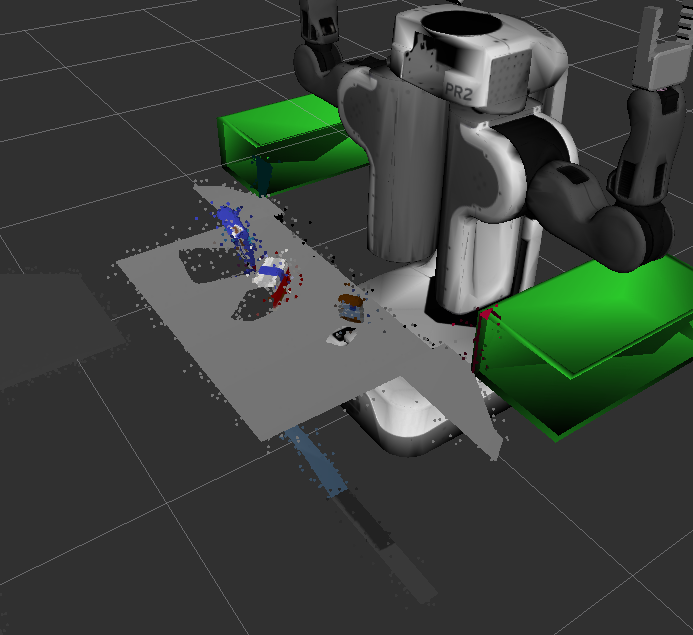
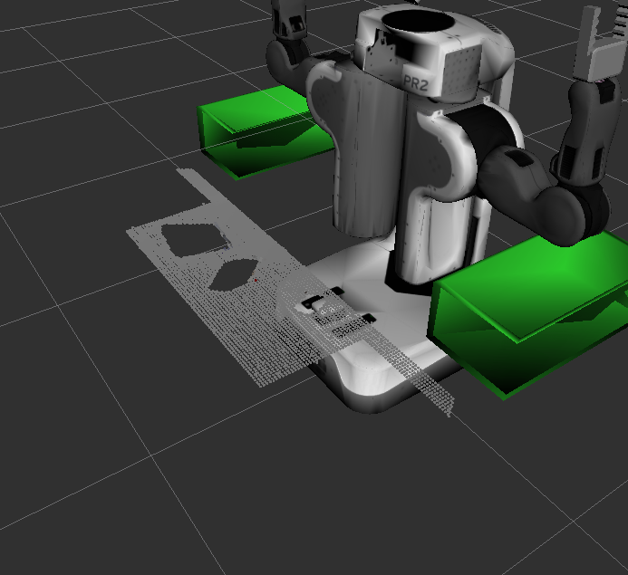
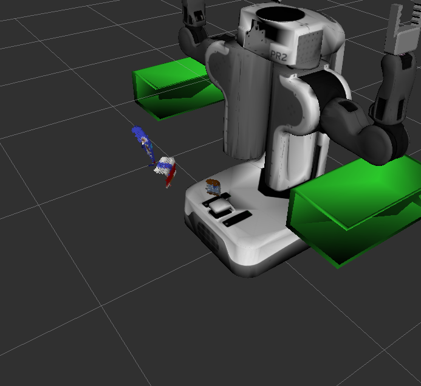
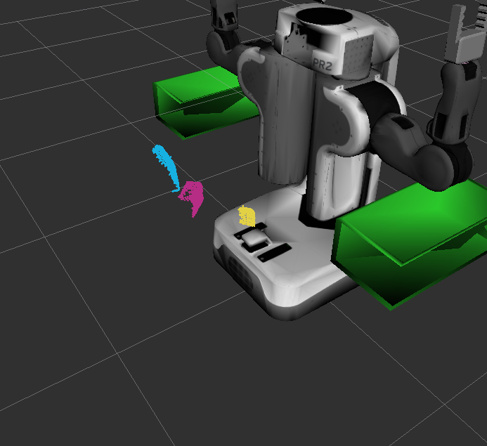
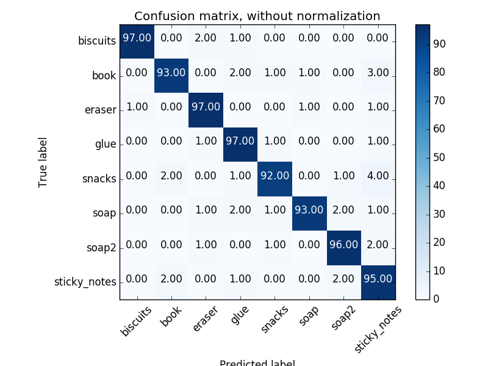
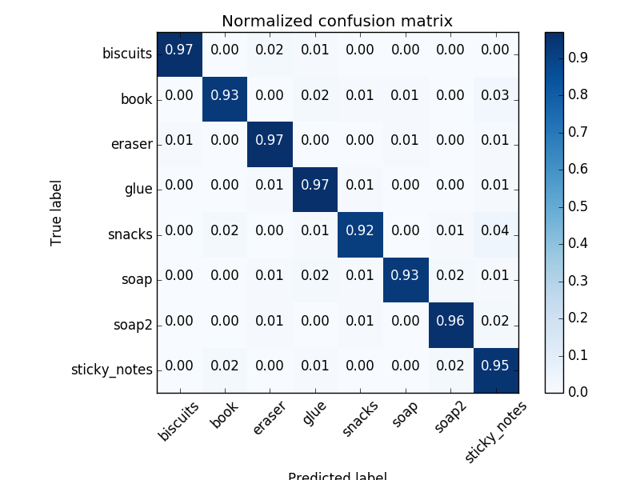
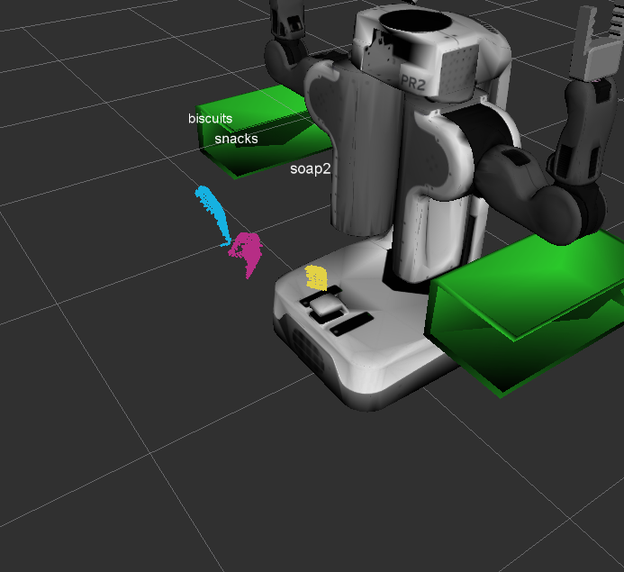

## Project: Perception Pick & Place

---

# Required Steps for a Passing Submission:
1. Extract features and train an SVM model on new objects (see `pick_list_*.yaml` in `/pr2_robot/config/` for the list of models you'll be trying to identify). 
2. Write a ROS node and subscribe to `/pr2/world/points` topic. This topic contains noisy point cloud data that you must work with.
3. Use filtering and RANSAC plane fitting to isolate the objects of interest from the rest of the scene.
4. Apply Euclidean clustering to create separate clusters for individual items.
5. Perform object recognition on these objects and assign them labels (markers in RViz).
6. Calculate the centroid (average in x, y and z) of the set of points belonging to that each object.
7. Create ROS messages containing the details of each object (name, pick_pose, etc.) and write these messages out to `.yaml` files, one for each of the 3 scenarios (`test1-3.world` in `/pr2_robot/worlds/`).  [See the example `output.yaml` for details on what the output should look like.](https://github.com/udacity/RoboND-Perception-Project/blob/master/pr2_robot/config/output.yaml)  
8. Submit a link to your GitHub repo for the project or the Python code for your perception pipeline and your output `.yaml` files (3 `.yaml` files, one for each test world).  You must have correctly identified 100% of objects from `pick_list_1.yaml` for `test1.world`, 80% of items from `pick_list_2.yaml` for `test2.world` and 75% of items from `pick_list_3.yaml` in `test3.world`.
9. Congratulations!  Your Done!

---

## [Rubric](https://review.udacity.com/#!/rubrics/1067/view) Points

## Writeup / README

### Exercise 1, 2 and 3 pipeline implemented

The perception pipeline is implemented as described in the [walkthrough exercises](https://github.com/bkecskemeti/RoboND-Perception-Exercises):

*RGB-D image ==> Statistical outlier filter ==> Downsampling ==> Passthrough filter ==> RANSAC plane segmentation ==> Euclidean clustering ==> Object recognition*

The pipeline is implemented in [project_template.py](pr2_robot/scripts/project_template.py).

#### 1. Statistical outlier filter

First remove the noise present in the input image, using a statistical outlier filter.



I found the parameters for the statistical outlier filter experimentally, setting the number of neighboring points to `10` and threshold factor `0.2`. Data points with distance larger than `mean distance + 0.2 * std dev` will be removed as outliers:

```python
cloud_filtered = cloud.make_statistical_outlier_filter()
cloud_filtered.set_mean_k(10)    
cloud_filtered.set_std_dev_mul_thresh(0.2)
cloud_filtered = cloud_filtered.filter()
```

#### 2. Downsampling

I used `LEAF_SIZE = 0.01` to reduce the image resolution.

```python
vox = cloud_filtered.make_voxel_grid_filter()
LEAF_SIZE = 0.01
vox.set_leaf_size(LEAF_SIZE, LEAF_SIZE, LEAF_SIZE)
cloud_filtered = vox.filter() 
```

#### 3. Passthrough filter 

To exclude areas which are of no interest, I defined passthrough filters along the `x` and `z` axes.

This confines the space into the area `[0.4 .. 0.8, -inf .. \inf, 0.5 .. 0.8]`.

```python
passthrough = cloud_filtered.make_passthrough_filter()
passthrough.set_filter_field_name('z')
axis_min, axis_max = 0.5, 0.8
passthrough.set_filter_limits(axis_min, axis_max)

cloud_filtered = passthrough.filter()

passthrough = cloud_filtered.make_passthrough_filter()
passthrough.set_filter_field_name('x')
axis_min, axis_max = 0.4, 0.8
passthrough.set_filter_limits (axis_min, axis_max)
cloud_filtered = passthrough.filter()
```

#### 4. RANSAC plane segmentation 

RANSAC plane fitting will separate the points belonging to the table and to the objects:

  

```python
seg = cloud_filtered.make_segmenter()

seg.set_model_type(pcl.SACMODEL_PLANE)
seg.set_method_type(pcl.SAC_RANSAC)

max_distance = 0.01
seg.set_distance_threshold(max_distance)

inliers, coefficients = seg.segment()

cloud_table = cloud_filtered.extract(inliers, negative=False)
cloud_objects = cloud_filtered.extract(inliers, negative=True)
```

#### 5. Euclidean clustering 

The goal is to find clusters in the data points using Euclidean clustering. Points close to each other are identified as belonging to distinct objects, which can be labelled later on.



```python
white_cloud = XYZRGB_to_XYZ(cloud_objects)
tree = white_cloud.make_kdtree()

ec = white_cloud.make_EuclideanClusterExtraction()

ec.set_ClusterTolerance(0.01)
ec.set_MinClusterSize(100)
ec.set_MaxClusterSize(10000)

ec.set_SearchMethod(tree)

cluster_indices = ec.Extract()
```

#### 6. Object recognition

The steps to classify the clustered data points are the following:
1. Generate training data using [capture_features.py](./pr2_robot/scripts/capture_features.py). For each possible pick list item, `100` sample instances were generated in random orientation.
2. Train the SVM using [train_svm.py](./pr2_robot/scripts/train_svm.py)
3. Extract features from the point clusters and classify them using the trained SVM, in [project_template.py](pr2_robot/scripts/project_template.py).

##### Training the SVM classifier

Features are extracted using [features.py](./pr2_robot/scripts/features.py). The feature vector is a concatenation of the HSV color histogram (#bins=32, range=0..256) and the surface normal histogram (#bins=32, range=-1..1). I tried also with 16 bins, but the results were not so good.

The original and normalized confusion matrices are:

  

##### Classify point clusters

For each cluster, extract the feature vector:

```python
chists = compute_color_histograms(ros_cluster, using_hsv=True)
normals = get_normals(ros_cluster)
nhists = compute_normal_histograms(normals)
feature = np.concatenate((chists, nhists))
```

Use the trained model for predicting a label:
```python
prediction = clf.predict(scaler.transform(feature.reshape(1,-1)))
label = encoder.inverse_transform(prediction)[0]
detected_objects_labels.append(label)
```

Publish the labels to a topic to be displayed in RViz:
```python
label_pos = list(white_cloud[pts_list[0]])
label_pos[2] += .4
object_markers_pub.publish(make_label(label,label_pos, index))
```




### Pick and Place Setup

#### 1. For all three tabletop setups (`test*.world`), perform object recognition, then read in respective pick list (`pick_list_*.yaml`). Next construct the messages that would comprise a valid `PickPlace` request output them to `.yaml` format.

Steps to generate the `PickPlace` requests:

1. Read pick list:
```python
pick_list = rospy.get_param('/object_list')
```

2. Read stow locations (to a map by `group` as identifier key):
```python
dropbox_map = dict([dropbox['group'], dropbox] for dropbox in rospy.get_param('/dropbox')) 
```

3. For each pick list item, see if we have it in the object list given by perception:
```python
matches = [do for do in object_list if do.label == item_name]
```

If there are no objects in the scene, which are perceived to be the pick list item, log the missing item and go to the next pick list item.

If there are multiple matching objects, take the first one.

4. Calculate pick pose, place pose, and other necessary output

* The pick pose is the centroid of the cluster,
* The place pose is the position of the dropbox assigned to the picklist item,
* The arm name is the one closer to the dropbox assigned to the picklist item (left or right).

```python
object_name = String()
object_name.data = str(target_object.label)

arm_name = String()
arm_name.data = dropbox_map[item_group]['name']

pick_coords = np.mean(ros_to_pcl(target_object.cloud).to_array(), axis=0)[:3]

place_coords = dropbox_map[item_group]['position']

yaml_dict = make_yaml_dict(test_scene_num, arm_name, object_name, pose(pick_coords), pose(place_coords))
output.append(yaml_dict)

rospy.loginfo("Pick item = %s, arm = %s, pick_pos = %s, place_pos = %s" % (item_name, arm_name.data, pick_coords, place_coords))
```

#### Results

world | identified | total | success ratio | link
--- | --- | --- | --- | ---
1 | 3 | 3 | 100% | [output_1.yaml](./output/output_1.yaml)
2 | 5 | 5 | 100% | [output_2.yaml](./output/output_2.yaml)
3 | 6 | 8 |  75% | [output_3.yaml](./output/output_3.yaml)


### Possible improvements

* Improve robustness: objects are not always identified consistently, sometimes the labels change or disappear. Some logic could be developed which tracks objects and their labels and establishes a confidence level for each object relative to each label.


